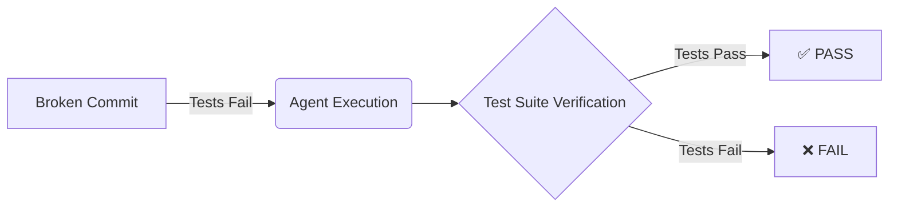

<h1 align="center">Precedent 🚀</h1>

<p align="center">
  <strong>The Ultimate Autonomous Benchmarking Framework for AI Coding Agents</strong><br>
  <a href="https://github.com/precedent-cli/precedent/actions"></a>
  <a href="https://goreportcard.com/report/github.com/precedent-cli/precedent"></a>
  <a href="https://opensource.org/licenses/MIT"></a>
</p>

---

**Precedent** is an advanced, terminal-based benchmarking tool designed to evaluate the real-world performance of AI coding agents against your own codebase. By leveraging historical bugs, Precedent strictly evaluates whether an agent can autonomously fix real issues, generating a comprehensive HTML scorecard of its capabilities.

Whether you are a developer testing your first AI assistant or a senior engineer designing a rigorous evaluation pipeline, this manual provides everything you need to get started.

## 🌟 Why Precedent?

Many AI benchmarks rely on synthetic, artificial tests that do not reflect actual engineering workflows. Precedent introduces the **Fail-to-Pass Methodology**:

1. **Mining:** Precedent scans your project's Git history for commits that explicitly fixed a bug.
2. **Validation:** It ensures the test suite *failed* before the commit (the bug) and *passed* after it (the fix).
3. **Execution:** The AI agent is dropped into the broken, historical state and tasked with fixing the bug autonomously.
4. **Verification:** Precedent runs your test suite against the AI's code to determine absolute success.



---

## 🚀 Quickstart Guide

### 1. Installation

**macOS (Homebrew)**
```bash
brew tap precedent-cli/tap
brew install precedent
```

**Linux / Windows (Go)**
```bash
go install github.com/precedent-cli/precedent@latest
```

### 2. Initialize the Benchmark
Navigate to any project directory with a Git history and run:
```bash
cd your-project
precedent init
```
**Options:**
- `--test-cmd "COMMAND"`: Explicitly specify your test command (e.g., `"npm test"` or `"go test ./..."`). Precedent will automatically attempt to detect this if omitted.
- `--relaxed`: Skips the strict Fail-to-Pass verification during the mining phase. Useful if older historical commits have fundamentally broken test configurations.

### 3. Run the AI Race
Evaluate your selected AI agent against the mined tasks:
```bash
precedent run --agent claude --docker-image node:18 --yes
```
**Key Flags:**
- `--agent NAME`: Choose the AI adapter (default: `claude`).
- `--docker-image IMAGE`: Run verification tests inside a secure Docker container (e.g., `node:18`). If omitted, tests execute on your host machine.
- `--max-cost AMOUNT`: Abort execution if the cumulative USD cost exceeds this limit (default: $5.00). Supported natively by the `claude` adapter.
- `--concurrency N`: Run multiple AI tasks in parallel to speed up evaluations (0 = auto-detect based on CPU cores).

---

## 🤖 Bring Your Own Agent (BYOA)

Precedent is entirely agnostic. You can benchmark *any* CLI-based AI coding agent through YAML configuration.

Create a `.precedent/agents.yaml` file in your project root:

```yaml
aider:
  # The task description is injected safely via the $PRECEDENT_PROMPT environment variable.
  command: 'aider --message "$PRECEDENT_PROMPT" --yes'
```

> **Security Note:** To prevent prompt injection attacks, never interpolate the prompt directly into the command string. Precedent provides `$PRECEDENT_PROMPT` (the bug description) and `$PRECEDENT_WORKTREE` (the absolute directory path) securely via environment variables. Always use these environment variables in your command definitions.

---

## 📊 Understanding the Scorecard

Upon completion, Precedent generates a self-contained, offline-safe `scorecard.html`. The statuses include:
- **PASS (✅)**: The agent successfully fixed the bug, and the test command passed.
- **FAIL (❌)**: The agent failed (test execution failed, the codebase did not compile, or the agent timed out/errored).
- **UNVERIFIED (⚠️)**: The agent completed its task, but no test command was provided to verify the fix.
- **SKIPPED (⏭️)**: The task was aborted or skipped by the user (e.g., pressing `q` during execution).

---

## 🔒 Security Model

Executing untrusted, AI-generated code requires robust security. Precedent mitigates risks through:

1. **Docker Sandboxing:** By using the `--docker-image` flag, test commands are executed in a heavily isolated container with no network access, stripped capabilities, and no new privileges (`--network=none --security-opt=no-new-privileges --cap-drop=ALL`).
2. **Explicit Trust Boundaries:** If `--docker-image` is omitted, Precedent will actively warn you before running test commands directly on your host machine.
3. **Interactive Prompts:** Unless bypassed with the `--yes` flag, Precedent requires manual confirmation before executing test suites against AI-modified code.

*Recommendation: Always use `--docker-image` for untrusted execution to protect your host environment.*

---

<p align="center">
  Built with ❤️ for the AI Engineering community.
</p>
